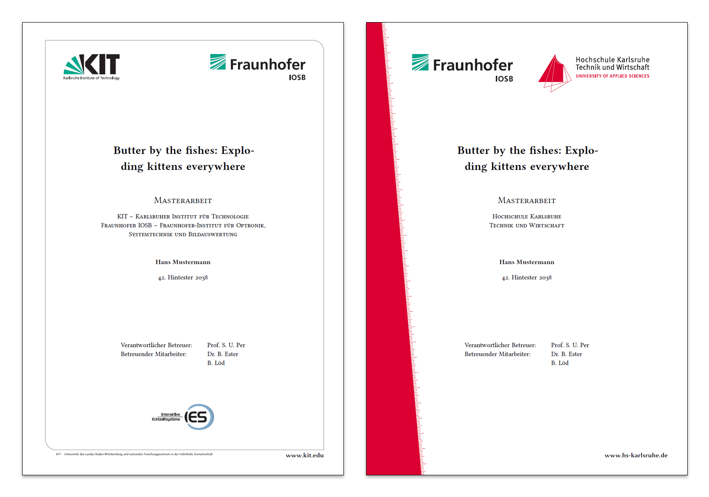

# LaTeX template for bachelor and master theses
This repository contains a LaTeX template for bachelor and master theses. After cloning change the content of the `README.md` file. It should contain the title of your thesis and your abstract. Furthermore, at the end of your thesis it should contain a section showing how to use the code you've produced during your thesis.

## Table of Contents
1. [Installation instructions for advisors](https://gitlab-ext.iosb.fraunhofer.de/goldat/thesistemplate#installation)
2. [Code](https://gitlab-ext.iosb.fraunhofer.de/goldat/thesistemplate#code)
3. [Presentation slides](https://gitlab-ext.iosb.fraunhofer.de/goldat/thesistemplate#presentation-slides)
4. [Thesis](https://gitlab-ext.iosb.fraunhofer.de/goldat/thesistemplate#thesis)
5. [Literature](https://gitlab-ext.iosb.fraunhofer.de/goldat/thesistemplate#literature)
6. [Some tips and useful applications](https://gitlab-ext.iosb.fraunhofer.de/goldat/thesistemplate#some-tips-and-useful-applications)



## Installation instruction for advisors
Prerequisite: Your student should have access to the `gitlab-ext` server. 
1. Fork the repository to `vid-student-theses / bachelor` or `vid-student-theses / master`.
2. **Important**: REMOVE FORK! Go to `Settings` > `General` > `Advanced settings` > `Remove fork relationship`. If you skip this, nobody won't be able to create another copy of the repository.
3. Within the same settings, go to `Rename repository`.
4. Set new project name (starting with the ending year and month of the thesis) and path. E.g.
    - Project name: "YYYY-MM Your awesome thesis title" 
    - Path: "Your-awesome-thesis-title"
5. Give the link to the repository to your student.

**Note**: It's your choice whether you make a second repository for programm code or not. This repository should contain at least the LaTeX code of the thesis.

## Code
Code that was produced during your thesis should be in this folder. You should create a directory for each programming language you've used, e.g. `c++`, `python`, `go`, etc. Furthermore this part of the repository should contain a `models` folder, if you've developed and trained custom models. You should generate some kind of documentation for your runnable scripts and applications. This can be done in another folder, called `documentation`.

For further information see [code folder](https://gitlab-ext.iosb.fraunhofer.de/goldat/thesistemplate/blob/master/code/information.md).

## Presentation slides
All presentations held during your thesis should be available here, including all original images and visualizations. When working with Microsoft PowerPoint always create an additional pdf file. Keep in mind the following naming convention.
```
{yyyy_mm_dd}_{zwischenvortrag, abschlussvortrag}_{name of your thesis}.{pptx, pdf}
```
For further information see [presentation folder](https://gitlab-ext.iosb.fraunhofer.de/goldat/thesistemplate/blob/master/presentations/information.md).

## Thesis
This folder contains your LaTeX code. When pushed to the remote repository, gitlab will automatically create a pdf file of your LaTeX code.

## Literature
This folder contains all related work.
```
{year}_{last name of first author}_{title}_{conference_titel_abbreviation}.pdf

Example:
2017_Cinelli_Anomaly_Detection_in_Surveillance_Videos_using_Deep_Residual_Networks_Diss.pdf
```
For further information see [literature folder](https://gitlab-ext.iosb.fraunhofer.de/goldat/thesistemplate/blob/master/literature/information.md).

## Some tips and useful applications
* If possible, use **vector graphics** within your work. E. g. generated plots from Python can easily be saved as vector graphics.
* For graphs and different visualizations with a graph like structure, take a look at [yEd](https://www.yworks.com/downloads#yEd).
* For simple class diagrams take a look at [UMLet](http://www.umlet.com/).
* Another useful tool is the [.gitignore file generator](https://www.gitignore.io/). Add your used software and it generates automatically a .gitignore-File.
* Some useful hints for [training deep neural networks](https://arxiv.org/pdf/1803.09820v1.pdf)
