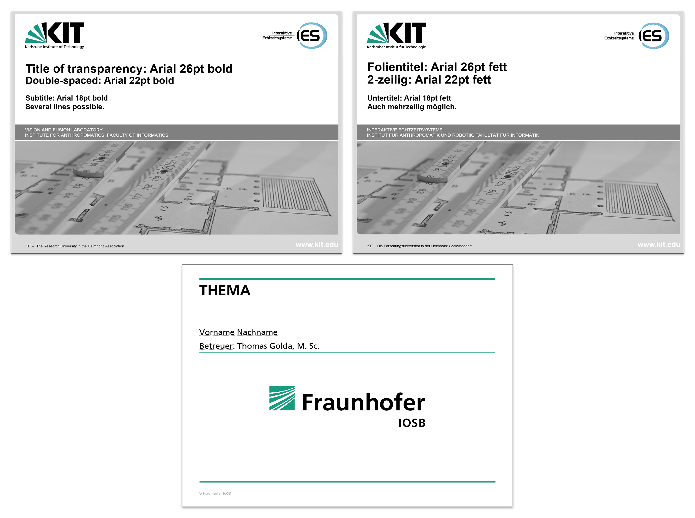

# Presentation slides
Put your PowerPoint or LaTeX slides here, including a pdf version. All presentations held during your thesis should be available here, including all original images and visualizations. When working with Microsoft PowerPoint always create an additional pdf file. Keep in mind the following naming convention.
```
{yyyy_mm_dd}_{zwischenvortrag, abschlussvortrag}_{name of your thesis}.{pptx, pdf}
```

There are three (PowerPoint) templates within this folder:
* KIT template (english)
* KIT template (german)
* Fraunhofer IOSB template (german)


